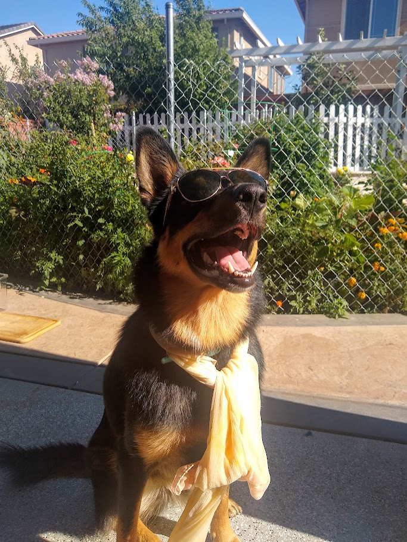
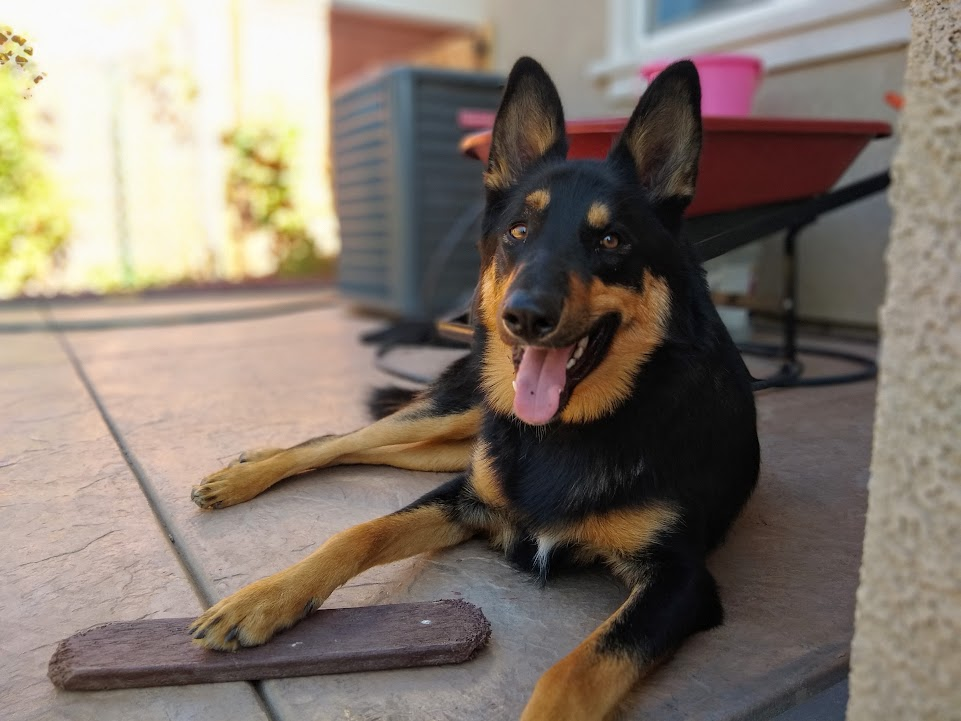
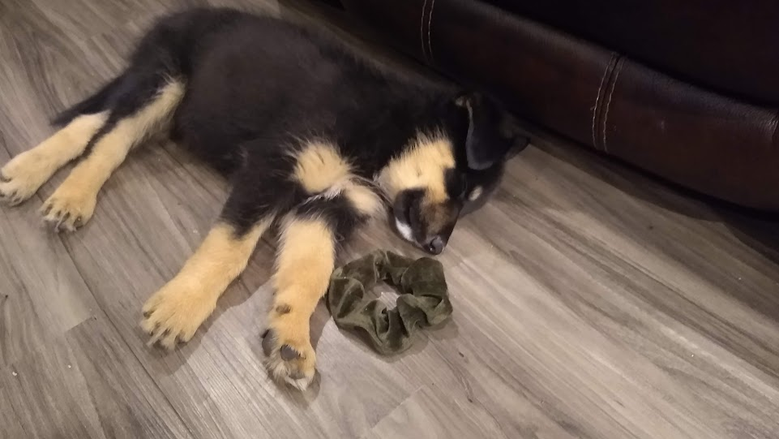

# 👋Hey! My name is Charan Battula

# Table of Contents
- [👋Hey! My name is Charan Battula](#hey-my-name-is-charan-battula)
- [Table of Contents](#table-of-contents)
  - [Introduction](#introduction)
  - [Professional Experience](#professional-experience)
  - [Projects](#projects)
  - [Skills](#skills)
  - [More About Me Beyond Programming:](#more-about-me-beyond-programming)

---
## Introduction

I am currently pursuing a Bachelor's degree in Computer Science at the University of California, San Diego (UCSD) and am avidly pursuing the various fields of programming, especially machine learning and artificial intelligence 

## Professional Experience

- **Meta** (Upcoming Internship)
  *June 2025 - September 2025*
  *SWE Intern*

- **LPL Financial**  
  *June 2024 – August 2024*  
  *Computer Science Summer Intern*  
  Worked on migrating on-premises data to cloud solutions using AWS Glue, Lambda, and S3 buckets. Developed backend services in Python, ensuring high-quality code with over 70% code coverage. 

## Projects

Here are some of the projects I've worked on:

1. **Triton Tutor**  
   A platform designed to enhance learning experiences, providing personalized tutoring services to students. [View Project](https://devpost.com/software/triton-tutor-ucsd-s-gateway-to-mastery-dive-deep-with-triton-tutor)

3. **Vault**  
   A security platform that utilizes facial recognition and SQL databases to verify meeting participants, ensuring secure virtual interactions. [Learn More](https://devpost.com/software/vault-vault-is-a-security-platform-that-avoids-unknown-people-joining-meetings)

2. **Data Shelter**  
   An application aimed at raising awareness about animal adoption trends and combating animal cruelty by providing insightful data visualizations. [Explore More](https://devpost.com/software/data-shelter)

## Skills

- **Programming Languages:** Python, Java, C++
- **Frameworks & Technologies:** AWS (Glue, Lambda, S3), Flask, Django, OpenCV, TensorFlow
- **Tools & Platforms:** Git, Docker, CircleCI, Firebase

## More About Me Beyond Programming:

When I am not working programming classes and internships, I am often playing sports like tennis and basketball, watching shows and movies (One Piece, Severance, Solo Leveling, Invincible), or playing video games.  I am more of a story-game player having recently completed Elden Ring and Red Dead Redemption 2, I have been also been into Pokemon and other games like this.  Beyond all this, when I am home, I'm often walking or talking pictures of my dog Tommy (a German Shepherd/Border Collie/Shark mix 😆) so here are a few of his pictures:

